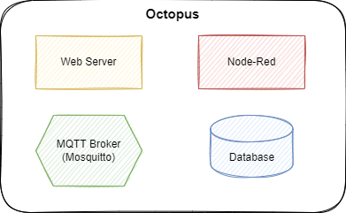
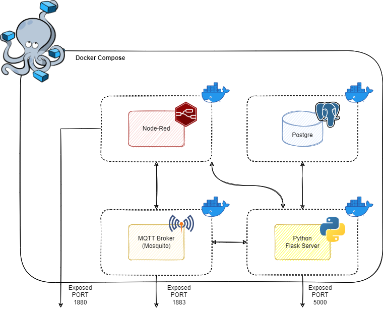
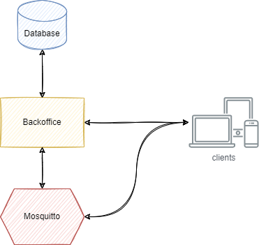

# Octopus

Octopus es un sistema de monitorización y comunicación entre dispositivos inteligentes.

## Descripción del proyecto

Se propone una solución muy común en el mundo del IoT (Internet of Things), basada en el protocolo MQTT y el patrón publicador/suscriptor. Los diferentes dispositivos inteligentes se comunicarán a través de este protocolo con Octopus.


Octopus es un sistema completo compuesto por todas las piezas necesarias para su funcionamiento: un servidor web, una base de datos y un broker MQTT, necesario para el uso de este protocolo y un servidor Node-Red. Todos estos componentes son englobados usando como abstracción la tecnología de contenerización, reduciendo al mínimo los problemas de portabilidad, compatibilidad y despliegue.



**Nota**: Estos diagramas muestran como sería el proyecto desplegado en su versión para explotación. En la versión de desarrollo el servidor web no está contenerizado o la base de datos está expuesta al exterior por motivos de agilidad.

Así, a efectos de uso, Octopus es una "caja negra". Únicamente debe crearse y arrancar el contenedor con un solo comando. Una vez hecho, el sistema está listo para comunicar a los diferentes clientes IoT que se conecten y sus servidores web y Node-Red están accesibles.


De manera interna, Octopus está compuesto por diferentes sistemas contenerizados que se comunican entre sí o son expuestos al exterior si es necesario.



### Node-Red vs Servidor Web propio

Node-RED es un motor de flujos con enfoque IoT, que permite definir gráficamente flujos de servicios. Aún no está claro cuánto brinda Node-RED con respecto a una implementación propia. Por ello, aún no está claro cuánta parte de trabajo caerá sobre Node-RED y cuánta sobre el servidor web propio. Si Node-RED brindase toda la potencia y flexibilidad necesarias (ya que puede incluso producir APIs y escribir en base de datos) el servidor web podría llegar a desaparecer. O quizá se descubra que lo adecuado sea optar por una solución intermedia utilizando Node-RED para ciertas tareas como el envío de notificaciones y el backoffice para visualizar o configurar ciertas opciones, o puede que Node-RED se muestre poco ventajoso y se opte por una implementación completamente propia. Son incertidumbres que resolverá la experimentación y la formación.


Formato de los topics:
```
oficina/sala/dispositivo/atributo
```

Algunos ejemplos podrían ser:
```
oficina/servidores/servidor1/temperatura
oficina/reuniones/aire/rpm
oficina/servidores/luz/brillo
```

### Consideraciones de Seguridad

* Para la comunicación HTTP, se implementarán los mecanismos típicos de autenticación, autorización y cifrado comunes en cualquier aplicación web.
* La comunicación MQTT podrá también ser securizada mediante los diferentes mecanismos que ofrece el *Mosquitto*: cifrado SSL, autenticación y autorización mediante usuario/contraseña y listas de control de acceso.

### Consideraciones de rendimiento

MQTT es un protocolo muy ligero. La naturaleza de los proyectos IoT se basa en una monitorización en tiempo real y una respuesta rápida de los diferentes dispositivos involucrados. Por ello, se opta por la siguiente consideración a nivel de arquitectura:



Los clientes pueden atacar al backoffice para listar los dispositivos o tópicos disponibles para suscribirse, pero los datos en sí serán transmitidos directamente por MQTT. Por defecto, se recibirán numerosos mensajes por segundo, multiplicados por cada dispositivo. Involucrar de alguna manera al protocolo HTTP o consultas a la base de datos por cada una de estas peticiones sería altamente ineficiente, por lo que estas interacciones deben estudiarse bien.


## Tecnologías empleadas

* Docker y Docker-Compose como tecnología de virtualización.
* Mosquitto como Broker MQTT.
* Postgre como Base de datos.
* Node-Red como motor de flujos.
* Python (Flask) como framework para el desarrollo del servidor web debido a su facilidad y velocidad de desarrollo. Tras una primera prueba de concepto puede valorarse Spring Boot.


## Arrancar el proyecto

El ecosistema se ofrece dockerizado y orquestado por *Docker Compose*, por lo que el único paso necesario será situarse en el directorio raíz de este proyecto y ejecutar el comando:

```
docker-compose up
```

Eso es todo lo necesario para levantar el ecosistema:
* Mosquitto estará disponible en `localhost:1883`
* El panel web de Node-Red estará disponible bajo `localhost:1880`
* La base de datos estará disponible bajo `localhost:5432`


Cabe recordar que Docker-Compose organiza su networking interno por el nombre de los servicios (pueden verse en el fichero `docker-compose.yaml`). Esto significa que si desde el contenedor de Node-Red se quiere por ejemplo alcanzar a *Mosquitto*, este será visible bajo la dirección `mosquitto:1883`, o si desde *Mosquitto* se quisiera conectar a la base de datos esta se resolvería con `postgre:5432`.

### Consideraciones importantes sobre *Mosquitto*

Hay dos ficheros de *Mosquitto* que es necesario mencionar:

```
/mosquito/config/mosquitto.conf
/mosquitto/log/mosquitto.log
```
* El fichero `mosquitto.conf` contiene la configuración básica y es necesario para el arranque de *Mosquitto*. Este fichero está mapeado al fichero `mosquitto/mosquitto.conf` en el proyecto, por lo que las configuraciones pueden hacerse desde este mismo fichero sin necesidad de entrar en el contenedor de *Mosquitto*.
* El fichero `mosquitto.log` contiene los logs de *Mosquitto*, mostrando los clientes que se conectan y desconectan o el estado del sistema y pudiendo ser útil para depurar problemas. Este fichero por defecto no está mapeado a un volumen externo en el host anfitrión, aunque no hay inconveniente en hacerlo si se desea o bien se puede consultar desde el propio contendor. En cualquier caso, merece la pena destacar su existencia.

### Arrancar el servidor

Dado que el código fuente está escrito en Python, se recomienda crear un entorno virtual para no alterar o crear conflictos con las dependencias del sistema donde se ejecute el proyecto. Existen incontables formas y herramientas para crear un entorno virtual (como *virtualenv*). En cualquier caso, una vez creado y activado para el directorio `src`, se debe instalar las dependencias del proyecto:
```
pip install -r requirements.txt
```
Una vez instaladas las dependencias, ejecutar el servidor:
```
python app.py
```


#### Probando el proyecto
Una vez está todo arrancado, si se accede a `http://localhost:5000` debería visualizarse el portal web.
En el proyecto existe un fichero `src/client.py` que simula dos clientes que envían datos. Si se abre una segunda terminal (recordar activar el entorno virtual) y se lanza este script, los datos en el panel web deberían comenzar a oscilar en tiempo real.

